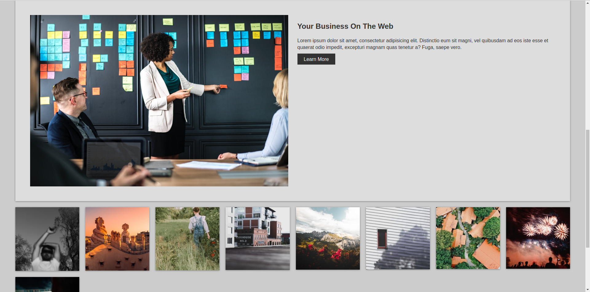
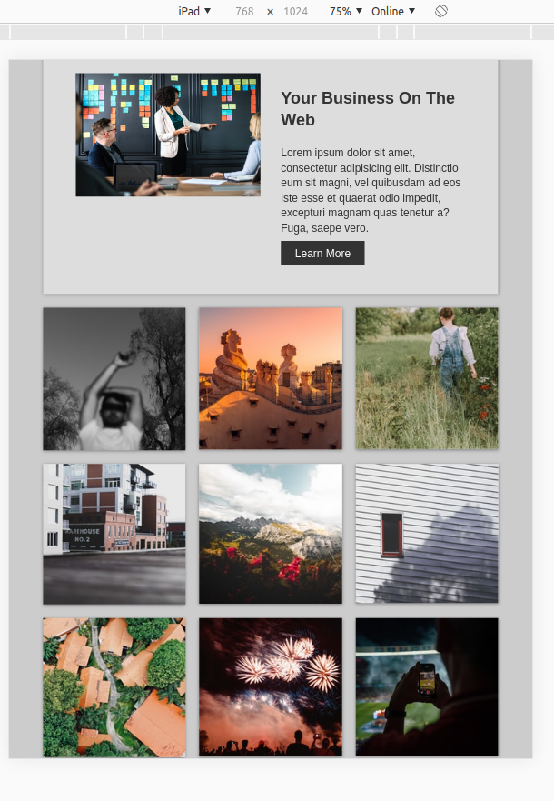

# Biz Website Tutorial

This is a website template based on the tutorial ["Build a Responsive Grid CSS Website Layout From Scratch"](https://www.youtube.com/watch?v=moBhzSC455o) from Traversy Media&trade;.

The configurations of the file [gulpfile.js](https://github.com/julianomacielferreira/biz-website-tutorial/blob/master/gulpfile.js) are based on the project ["Front-end Boilerplate using Sass and Gulp 4"](https://github.com/thecodercoder/frontend-boilerplate) from [thecodercoder](https://github.com/thecodercoder).

The images were downloaded from Pexels&trade; [https://www.pexels.com/](https://www.pexels.com/) - The best free stock photos & videos shared by talented creators.

The icons are from the Font Awesome&trade; [https://fontawesome.com/](https://fontawesome.com/) library.

# Disclaimer

I coded this website template only for the purpose of learning. **All the credits go to Traversy Media&trade;.**

- Traversy Media&trade; youtube channel: [https://www.youtube.com/channel/UC29ju8bIPH5as8OGnQzwJyA](https://www.youtube.com/channel/UC29ju8bIPH5as8OGnQzwJyA)

- Traversy Media&trade; site: [https://www.traversymedia.com/](https://www.traversymedia.com/)

- Pexels&trade; site: [https://www.pexels.com/](https://www.pexels.com/) 

- Font Awesome&trade; site: [https://fontawesome.com/](https://fontawesome.com/)

## How to Install and Run

**1. Check if you have a recent version of [Node.js](https://nodejs.org/) (which comes bundled with [npm](https://www.npmjs.com/), a JavaScript package manager), [gulp.js](https://gulpjs.com/) and [http-server](https://www.npmjs.com/package/http-server):**

```bash
$ node -v
```

```bash
$ npm -v
```

```bash
$ gulp -v
```

```bash
$ http-server -h
```

- If you don't have [gulp.js](https://gulpjs.com/), install gulp-cli globally with the following command:

```bash
$ sudo npm install gulp-cli -g
```

- If you don't have [http-server](https://www.npmjs.com/package/http-server), install globally with the following command:

```bash
$ sudo npm install http-server -g
```

**2. In the _project root directory_ install all the dependencies and libs:**

```bash
$ npm install
```

**3. Start the gulp tasks in watch mode:**

```bash
$ npm run gulp
```

**4. Start the webpack-dev-server:**

```bash
$ npm run start
```

**5. Access [http://localhost:8080/](http://localhost:8080/) on your browser.**

# License

Please see the [license
agreement](https://github.com/julianomacielferreira/biz-website-tutorial/blob/master/LICENSE).

# Screenshots






